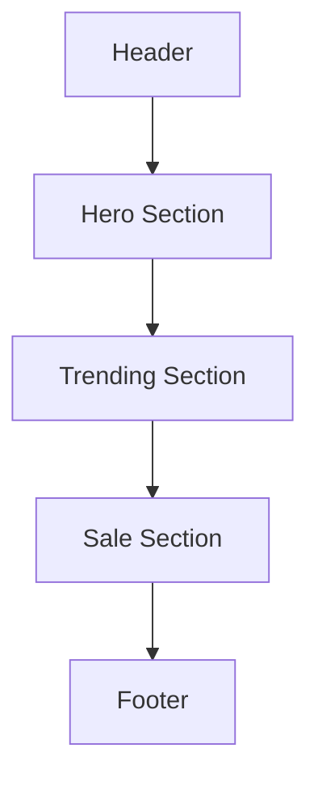

# Wireframe Trang Chủ - DEUX | Luxury Style (With CSS Classes)

Tài liệu này mô tả cấu trúc giao diện và các class CSS tương ứng của trang chủ DEUX.

## 1. Cấu trúc Tổng thể (Layout)

---

## 2. Chi tiết các thành phần

### A. Header (Thanh điều hướng)
- **Tag:** `<header>`
- **Logo:** `class="logo"`
- **Menu Wrapper:** `<nav id="nav-menu">`
    - Items: `class="nav-item"` (Class `active` khi đang ở trang đó).
    - Dropdown: `class="nav-has-dropdown"`, `class="nav-dropdown"`.
- **Actions Wrapper:** `class="nav-actions"`
    - Login Button: `class="btn btn-primary btn-login"`
    - Cart Button: `class="btn btn-primary btn-cart"`
- **Mobile Menu:** `class="menu-mobile" id="mobile-toggle"`

---

### B. Hero Section (Banner chính)
- **Tag:** `<section class="hero">`
- **Content Wrapper:** `class="hero-content"`
    - **Headline:** `<h1>` (Sử dụng `` cho từ nhấn mạnh).
    - **CTA Button:** `class="btn btn-primary btn-round btn-shop"`

---

### C. Trending Section (Xu hướng mới nhất)
- **Tag:** `<section class="collection" id="hot-section">`
- **Container:** `class="container"`
- **Title:** `class="section-title"`
- **Product Grid:** `class="grid" id="hot-grid"` (Attribute `data-scrollable="true"`).

---

### D. Sale Section (Ưu đãi đặc biệt)
- **Tag:** `<section class="collection sale-bg" id="sale-section">`
- **Container:** `class="container"`
- **Title:** `class="section-title"`
- **Product Grid:** `class="grid" id="sale-grid"` (Attribute `data-scrollable="true"`).

---

### E. Product Card (Thẻ Sản Phẩm - Render động)
- **Card Wrapper:** `class="card"`
- **Badge:** `class="badge badge-hot"` hoặc `class="badge badge-sale"`
- **Image Wrapper:** `class="img-placeholder"`
- **Content Wrapper:** `class="card-content"`
    - **Title:** `class="card-title"`
    - **Price Wrapper:** `class="card-price"`
        - Original: `class="old-price"`
        - Current: `class="new-price"`
    - **Add Button:** `class="btn btn-primary btn-full btn-add"`

---

### F. Footer (Chân trang)
- **Tag:** `<footer>`
- **Grid Wrapper:** `class="container footer-grid"`
- **Contact Info:** `class="footer-contact"`
- **Bottom Bar:** `class="footer-bottom"`

---

## 3. Ghi chú thiết kế (Design Notes)
- **Kích thước:** Header cao `70px`. Section cao `100vh` (hoặc linh hoạt theo nội dung).
- **Màu sắc:** Sử dụng các biến `:root` như `--primary-blue`, `--white-cream`, `--text-dark`.
- **Hiệu ứng:** 
    - Smooth scroll (`scroll-behavior: smooth`).
    - Blur & Transparency cho header (`backdrop-filter: blur(20px)`).
    - Hover effects cho card và button dùng `transition: 0.4s`.
